# Task 2：Create database and table in MySQL server

## 2-1 Create database

```sql
CREATE DATABASE website;
USE website;
SELECT DATABASE();
```

## Result 2-1

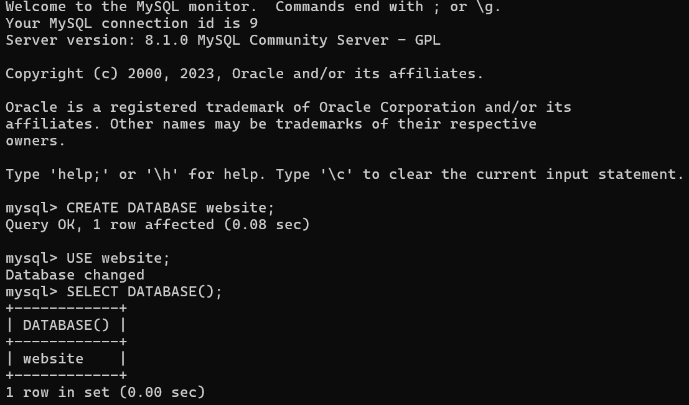

## 2-2 Create table

```sql
CREATE TABLE member (
id BIGINT UNSIGNED PRIMARY KEY AUTO_INCREMENT,
name VARCHAR(255) NOT NULL,
email VARCHAR(255) NOT NULL,
password VARCHAR(255) NOT NULL,
follower_count INT UNSIGNED NOT NULL DEFAULT 0,
time DATETIME NOT NULL DEFAULT CURRENT_TIMESTAMP
);
SHOW TABLES;
DESCRIBE member;
```

## Result 2-2

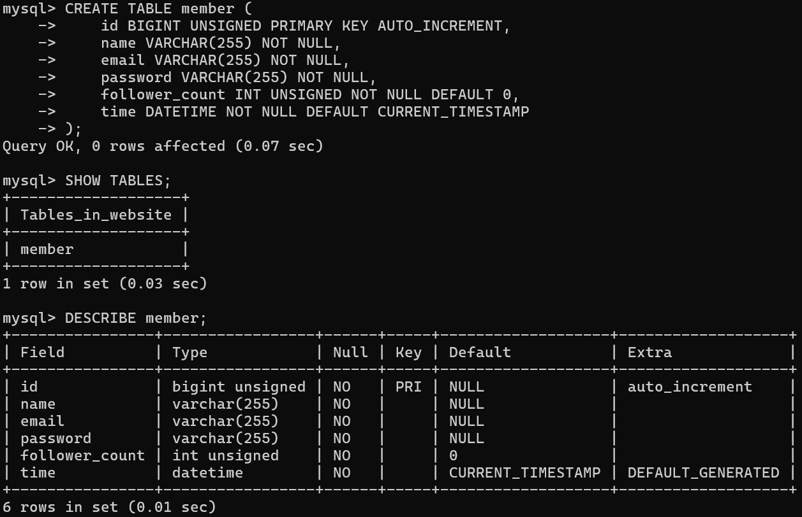

# Task 3: SQL CRUD

## 3-1

INSERT a new row to the member table where name, email and password must be set to test , test@test.com , and test . INSERT additional 4 rows with arbitrary data.

```sql
INSERT INTO member (name, email, password, follower_count)
VALUES ('test', 'test@test.com', 'test', 10);

INSERT INTO member (name, email, password, follower_count)
VALUES
('Alice', 'alice@example.com', 'alice123', 50),
('Bob', 'bob@example.com', 'bob123', 30),
('Chris', 'chris@example.com', 'chris123', 80),
('Daisy', 'daisy@example.com', 'daisy123', 20);
```

## Result 3-1

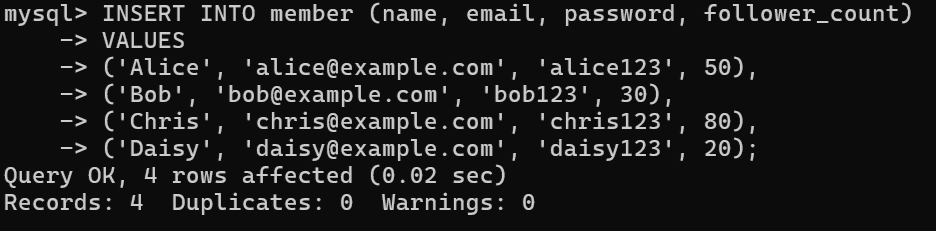

## 3-2

SELECT all rows from the member table.

```sql
SELECT * FROM member;
```

## Result 3-2

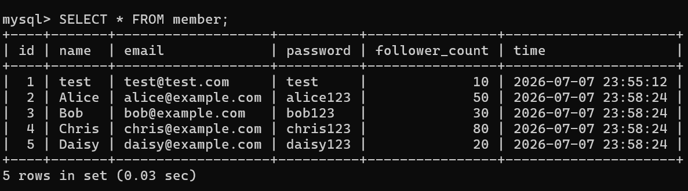

## 3-3

SELECT all rows from the member table, in descending order of time.

```sql
SELECT * FROM member
ORDER BY time DESC;
```

## Result 3-3

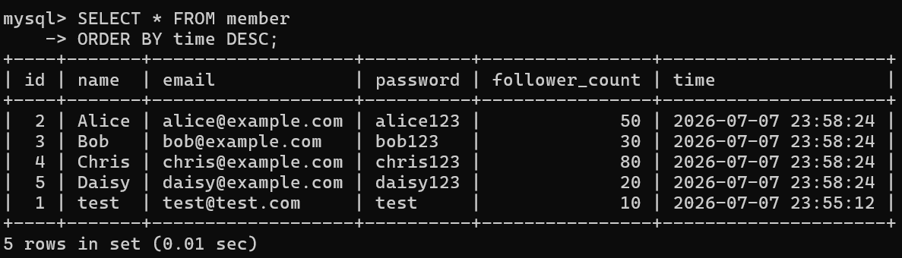

## 3-4

SELECT total 3 rows, second to fourth, from the member table, in descending order of time.

```sql
SELECT * FROM member
ORDER BY time DESC
LIMIT 3 OFFSET 1;
```

## Result 3-4

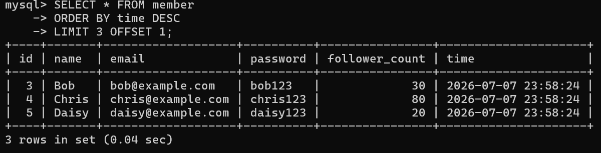

## 3-5

SELECT rows where email equals to test@test.com .

```sql
SELECT * FROM member
WHERE email = 'test@test.com';
```

## Result 3-5

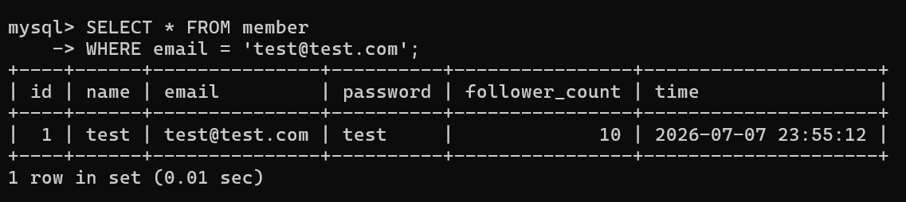

## 3-6

SELECT rows where name includes the es keyword.

```sql
SELECT * FROM member
WHERE name LIKE '%es%';
```

## Result 3-6

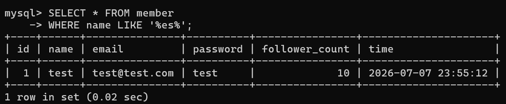

## 3-7

SELECT rows where email equals to test@test.com and password equals to test .

```sql
SELECT * FROM member
WHERE email = 'test@test.com'
AND password = 'test';
```

## Result 3-7

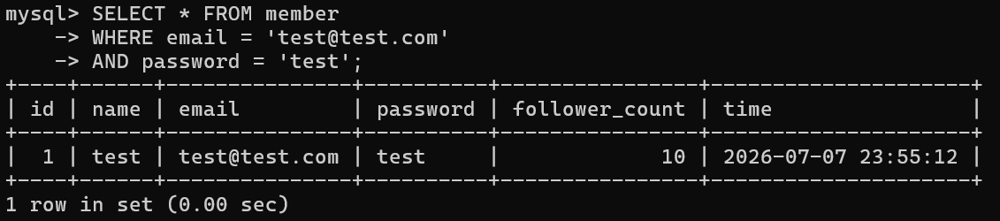

## 3-8

UPDATE data in name column to test2 where email equals to test@test.com .

```sql
UPDATE member
SET name = 'test2'
WHERE email = 'test@test.com';
```

## Result 3-8

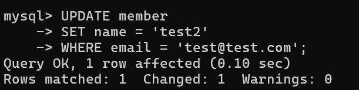

# Task 4: SQL Aggregation Functions

## 4-1

SELECT how many rows from the member table.

```sql
SELECT COUNT(*) FROM member;
```

## Result 4-1

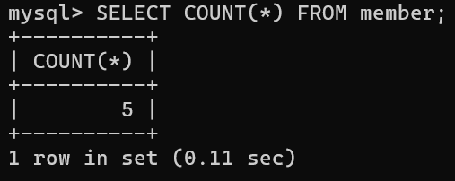

## 4-2

SELECT the sum of follower_count of all the rows from the member table.

```sql
SELECT SUM(follower_count) FROM member;
```

## Result 4-2

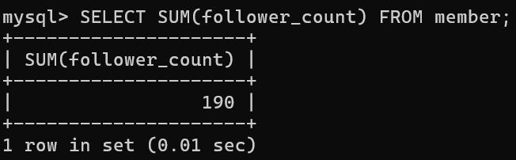

## 4-3

SELECT the average of follower_count of all the rows from the member table.

```sql
SELECT AVG(follower_count) FROM member;
```

## Result 4-3

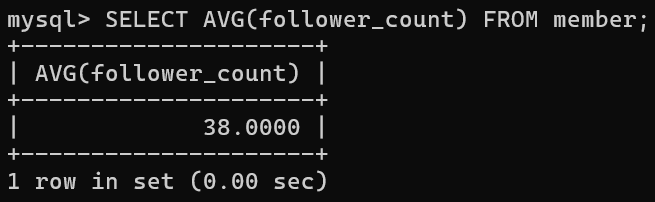

## 4-4

SELECT the average of follower_count of the first 2 rows, in descending order of follower_count, from the member table.

```sql
SELECT AVG(follower_count)
FROM (
    SELECT follower_count
    FROM member
    ORDER BY follower_count DESC
    LIMIT 2
) AS top_two;
```

## Result 4-4

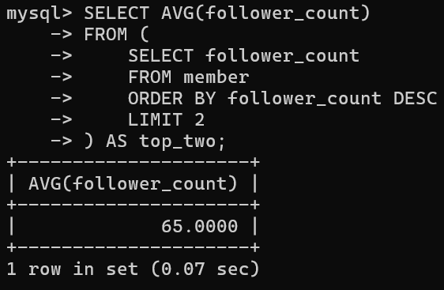

# Task 5: SQL JOIN

## 5-1

Create a new table named message , in the website database.

```sql
CREATE TABLE message (
    id BIGINT UNSIGNED PRIMARY KEY AUTO_INCREMENT,
    member_id BIGINT UNSIGNED NOT NULL,
    content TEXT NOT NULL,
    like_count INT UNSIGNED NOT NULL DEFAULT 0,
    time DATETIME NOT NULL DEFAULT CURRENT_TIMESTAMP,
    FOREIGN KEY (member_id) REFERENCES member(id)
);
SHOW TABLES;
DESCRIBE message;
```

## Result 5-1

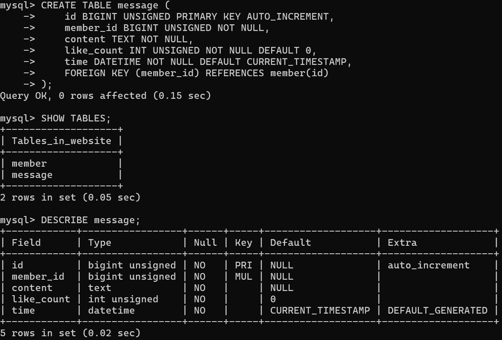

### Insert message data

```sql
INSERT INTO message (member_id, content, like_count)
VALUES
(1, 'Had a quiet morning with coffee.', 5),
(1, 'Finished my homework before dinner.', 12),

(2, 'Went for a short walk today.', 8),
(2, 'Cooked a simple meal at home.', 6),

(3, 'Read a few pages of a book.', 3),
(3, 'Listened to music after work.', 7),

(4, 'Tried a new cafe nearby.', 15),
(4, 'Spent some time organizing my desk.', 9),

(5, 'Watched a movie in the evening.', 4),
(5, 'Bought some fruit on the way home.', 10);
SELECT * FROM message;
```

## Result Insert message data

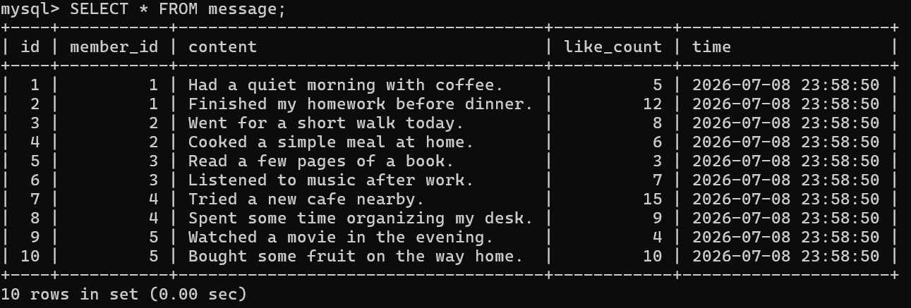

## 5-2

SELECT all messages, including sender names.
We have to JOIN the member table to get that.

```sql
SELECT message.id, member.name, message.content, message.like_count, message.time
FROM message
INNER JOIN member ON message.member_id = member.id;
```

## Result 5-2

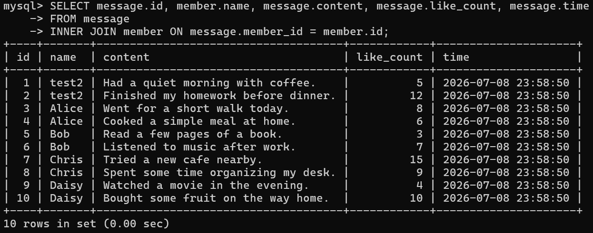

## 5-3

SELECT all messages, including sender names, where sender email equals to test@test.com . We have to JOIN the member table to filter and get that.

```sql
SELECT message.id, member.name, member.email, message.content, message.like_count, message.time
FROM message
INNER JOIN member ON message.member_id = member.id
WHERE member.email = 'test@test.com';
```

## Result 5-3

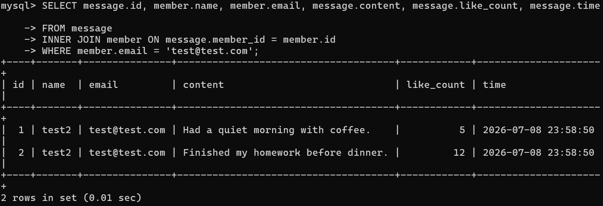

## 5-4

Use SELECT, SQL Aggregation Functions with JOIN statement, get the average like count of messages where sender email equals to test@test.com .

```sql
SELECT AVG(message.like_count)
FROM message
INNER JOIN member ON message.member_id = member.id
WHERE member.email = 'test@test.com';
```

## Result 5-4

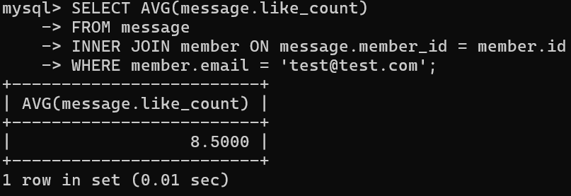

## 5-5

Use SELECT, SQL Aggregation Functions with JOIN statement, get the average like count of messages GROUP BY sender email.

```sql
SELECT member.email, AVG(message.like_count)
FROM message
INNER JOIN member ON message.member_id = member.id
GROUP BY member.email;
```

## Result 5-5

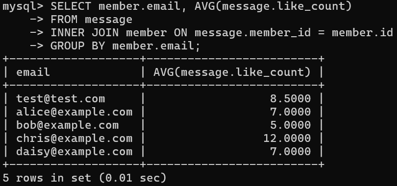
